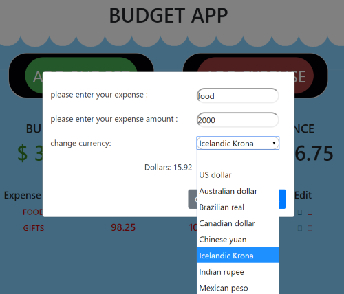

# Budget App

This project is an example of the budget app will work for one user. This budget app was created as a way to stay on budget while traveling, especially when dealing with foreign currencies. 

##Overview
Currently, the user is only able to store one budget and only store budget in US Dollars.  Creating a new budget will override the previous one. As the expenses are created, they are displayed in an easy-to-read list.

To create an expense using different currencies you can use the dropdown list to pick the desired currency, and type in the amount. The app will automatically convert this amount into dollars so you can better understand how much you are spending.

##Getting Started

These instructions will allow you to run this project locally on your machine.

1. Fork and clone the repo
1. npm install to install dependencies
1. npm start will open up browser and run the web app

